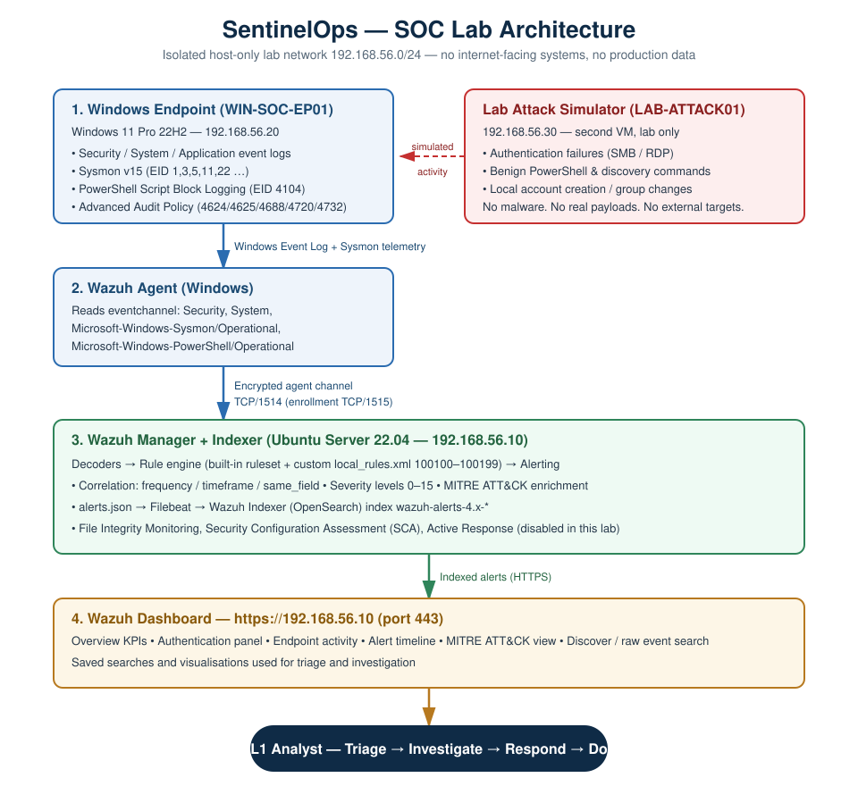

# SentinelOps

**A reproducible SOC Level 1 home lab: Windows threat detection with Wazuh SIEM, Sysmon and MITRE ATT&CK.**

SentinelOps is a blueprint for a small security-monitoring environment — one Windows endpoint,
one Wazuh manager, one analyst — together with 30 custom detection rules, a validation harness,
five incident-report templates, playbooks and full build documentation. It demonstrates SOC
analyst skills: detection engineering, log analysis, alert triage, investigation and incident
response, every detection mapped to MITRE ATT&CK.

> ### Project status — read this first
> This repository is a **blueprint + templates + validation harness. It has not yet been built
> or run.** No Wazuh manager, agent, Sysmon deployment, alert, dashboard or screenshot exists
> yet. Every detection rule is therefore **UNVERIFIED**, every incident report is a **template**,
> and every metric is **unmeasured**. Follow [`documentation/runbook.md`](documentation/runbook.md)
> to build the lab and turn UNVERIFIED into VERIFIED. Full honest status:
> [`audit.md`](audit.md).

---

## Architecture



Windows endpoint (Security + Sysmon + PowerShell logs) → Wazuh agent → Wazuh manager
(decoders → rules → alerts) → Wazuh indexer → dashboard → SOC L1 analyst. Design detail and
rationale: [`architecture/architecture.md`](architecture/architecture.md).

---

## Detection coverage

30 rules across five scenarios plus cross-cutting detections. **Status is taken honestly from
[`audit.md`](audit.md): no rule has been executed against `wazuh-logtest`, so all are
UNVERIFIED.** A rule becomes VERIFIED only when [`tests/run-logtest.sh`](tests/run-logtest.sh)
prints PASS for it on a live manager. Rules carrying `NEEDS-LOGTEST-VERIFICATION` in
[`detection-rules/local_rules.xml`](detection-rules/local_rules.xml) are the ones most likely to
need correction on first run.

| Technique | MITRE ID | Rule | Status |
|---|---|---|---|
| Brute force — failed logon (base) | T1110 | 100100 | UNVERIFIED |
| Brute force — failed-logon burst | T1110.001 | 100101 | UNVERIFIED |
| Successful logon after brute force | T1110.001 · T1078.003 | 100102 | UNVERIFIED |
| Account lockout | T1110 | 100103 | UNVERIFIED |
| Password spraying | T1110.003 | 100104 | UNVERIFIED |
| PowerShell launch (base) | T1059.001 | 100110 | UNVERIFIED |
| Suspicious PowerShell command line | T1059.001 · T1027.010 | 100111 | UNVERIFIED |
| Office / script host spawns a shell | T1204.002 · T1059.001 | 100112 | UNVERIFIED |
| PowerShell download cradle (4104) | T1059.001 · T1105 | 100113 | UNVERIFIED |
| Interpreter network connection | T1059.001 · T1105 | 100114 | UNVERIFIED |
| Defence / log tampering via PowerShell | T1562.001 · T1070.001 | 100115 | UNVERIFIED |
| Local account created | T1136.001 | 100120 | UNVERIFIED |
| New account added to privileged group | T1136.001 · T1098.007 | 100121 | UNVERIFIED |
| Account enabled / reset / modified | T1098 | 100122 | UNVERIFIED |
| Local account deleted | T1531 | 100123 | UNVERIFIED |
| Discovery command (base) | T1082 | 100130 | UNVERIFIED |
| Host reconnaissance burst | T1082 · T1087.001 · T1033 · T1016 | 100131 | UNVERIFIED |
| LOLBin download / proxy execution | T1218 · T1105 | 100132 | UNVERIFIED |
| Execution from a staging directory | T1204.002 | 100133 | UNVERIFIED |
| Renamed system binary (masquerade) | T1036.003 | 100134 | UNVERIFIED |
| Privileged group membership change | T1098.007 | 100140 | UNVERIFIED |
| Admin privileges assigned at logon | T1078.003 | 100141 | UNVERIFIED |
| UAC-bypass launcher | T1548.002 | 100142 | UNVERIFIED |
| Scheduled task created (Security log) | T1053.005 | 100143 | UNVERIFIED |
| Scheduled task via schtasks | T1053.005 | 100144 | UNVERIFIED |
| New Windows service installed | T1543.003 | 100145 | UNVERIFIED |
| Event log cleared | T1070.001 | 100150 | UNVERIFIED |
| Audit policy changed | T1562.002 | 100151 | UNVERIFIED |
| Sysmon service / config changed | T1562.001 | 100152 | UNVERIFIED |
| LSASS handle access | T1003.001 | 100153 | UNVERIFIED |

Rule sources and per-rule explanation: [`detection-rules/`](detection-rules/).
Full technique table and coverage gaps: [`documentation/mitre-attack-mapping.md`](documentation/mitre-attack-mapping.md).

---

## Screenshots

None captured yet — the lab has not been built. Capture guide (what to show, what to redact,
exact filenames): [`screenshots/README.md`](screenshots/README.md). Placeholders for the 10
required shots:

| # | Shot | File |
|---|------|------|
| 1 | Wazuh dashboard overview | `screenshots/01-wazuh-dashboard-overview.png` _(not captured)_ |
| 2 | Connected Windows agent (Active) | `screenshots/02-agent-connected.png` _(not captured)_ |
| 3 | Sysmon logs arriving | `screenshots/03-sysmon-logs.png` _(not captured)_ |
| 4 | Brute-force alert | `screenshots/04-brute-force-alert.png` _(not captured)_ |
| 5 | PowerShell alert (4104 script block) | `screenshots/05-powershell-alert.png` _(not captured)_ |
| 6 | Account-creation alert | `screenshots/06-account-creation-alert.png` _(not captured)_ |
| 7 | Suspicious-process alert | `screenshots/07-suspicious-process-alert.png` _(not captured)_ |
| 8 | MITRE ATT&CK mapping | `screenshots/08-mitre-attack-mapping.png` _(not captured)_ |
| 9 | Incident investigation | `screenshots/09-incident-investigation.png` _(not captured)_ |
| 10 | Final populated dashboard | `screenshots/10-final-dashboard.png` _(not captured)_ |

---

## Repository layout

```
SentinelOps/
├── README.md              This page
├── audit.md               Honest 16-phase coverage audit (what is / is not done)
├── LICENSE                MIT
├── architecture/          Lab architecture diagram (SVG) + design rationale
├── detection-rules/       30 Wazuh rules (local_rules.xml) + per-scenario explanation
├── sysmon/                Sysmon configuration + install/tuning guide
├── documentation/         Runbook, installation, detection engineering, investigation, IR, dashboard, MITRE
├── tests/                 logtest samples + run-logtest.sh (the rule-validation harness)
├── incidents/             Five incident-report TEMPLATES (fill from real evidence)
├── playbooks/             Five SOC L1 playbooks (triage → closure)
├── scripts/               Safe, lab-only PowerShell simulation + read-only helper scripts
├── screenshots/           Screenshot capture guide (no images yet)
└── career/                CV entry, LinkedIn text, interview Q&A, portfolio checklist
```

---

## Where to go next

| I want to… | Go to |
|---|---|
| Build the lab from nothing | [`documentation/runbook.md`](documentation/runbook.md) |
| Understand the detections | [`detection-rules/`](detection-rules/) |
| Prove the rules fire | [`tests/run-logtest.sh`](tests/run-logtest.sh) · [`tests/logtest/expected_results.md`](tests/logtest/expected_results.md) |
| See detection-engineering method | [`documentation/detection-engineering.md`](documentation/detection-engineering.md) |
| Learn the investigation workflow | [`documentation/investigation-process.md`](documentation/investigation-process.md) |
| Build the dashboards | [`documentation/dashboard.md`](documentation/dashboard.md) |
| Read an incident-report template | [`incidents/`](incidents/) |
| Check what is / is not verified | [`audit.md`](audit.md) |

**Technologies:** Wazuh 4.x · Windows 10/11 · Sysmon · Windows Event Logs · PowerShell ·
MITRE ATT&CK. Version specifics and minimum OS requirements are in the runbook.

---

## Disclaimer

Everything in this repository is designed for an **isolated laboratory** of virtual machines on
a private host-only network, owned by the person running it. The simulation scripts are
defensive testing tools that generate benign telemetry; they contain no malware, exploits or
real payloads and must only be run against systems you own and are authorised to test. All
incident reports contain simulated/template data, labelled as such. Provided for educational and
portfolio use under the [MIT License](LICENSE). Unauthorised access to computer systems is illegal.
