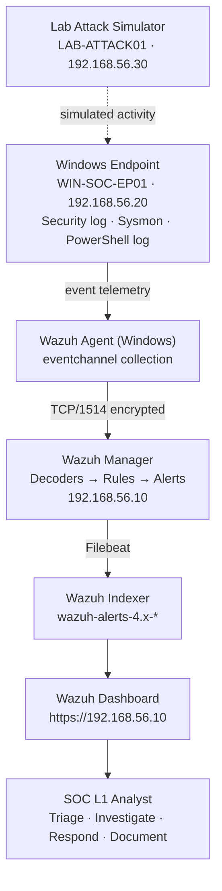

# SentinelOps — Lab Architecture

> **Laboratory environment.** Every host, IP address, user and alert described in this
> repository belongs to an isolated virtual lab. No production system, public IP address,
> real organisation or real user was involved at any point.

---

## 1. Design goal

SentinelOps simulates the monitoring stack of a very small organisation: **one monitored
Windows workstation, one SIEM, one analyst**. The architecture is deliberately minimal so
that every component can be explained in an interview, reproduced on a laptop, and traced
end to end — from the moment an event is written on the endpoint to the moment an alert is
triaged on the dashboard.

---

## 2. Logical flow

```
        ┌──────────────────────────────┐
        │   Windows Endpoint           │
        │   WIN-SOC-EP01               │
        │   Windows 11 Pro             │
        │                              │
        │   • Security event log       │
        │   • System / Application     │
        │   • Sysmon Operational log   │
        │   • PowerShell Operational   │
        └──────────────┬───────────────┘
                       │  Windows Event Log + Sysmon telemetry
                       v
        ┌──────────────────────────────┐
        │   Wazuh Agent (Windows)      │
        │   localfile = eventchannel   │
        └──────────────┬───────────────┘
                       │  encrypted agent channel  TCP/1514
                       │  enrollment               TCP/1515
                       v
        ┌──────────────────────────────┐
        │   Wazuh Manager              │
        │   Decoders → Rules → Alerts  │
        │   + Wazuh Indexer            │
        └──────────────┬───────────────┘
                       │  indexed alerts (wazuh-alerts-4.x-*)
                       v
        ┌──────────────────────────────┐
        │   Wazuh Dashboard            │
        │   https://192.168.56.10      │
        └──────────────┬───────────────┘
                       │
                       v
        ┌──────────────────────────────┐
        │   SOC L1 Analyst             │
        │   Triage → Investigate →     │
        │   Respond → Document         │
        └──────────────────────────────┘
```

A rendered version of the same diagram is available at
[`architecture.svg`](architecture.svg).



---

## 3. Components

| # | Component | Host name | OS / version | IP (lab only) | Role |
|---|-----------|-----------|--------------|---------------|------|
| 1 | Wazuh Manager + Indexer + Dashboard (all-in-one) | `wazuh-mgr` | Ubuntu Server 22.04 LTS | `192.168.56.10` | SIEM/XDR core: log decoding, rule matching, alert storage, dashboards |
| 2 | Monitored endpoint | `WIN-SOC-EP01` | Windows 11 Pro 22H2 | `192.168.56.20` | Victim workstation — generates all telemetry |
| 3 | Attack simulator | `LAB-ATTACK01` | Windows 10 Pro (or Kali Linux) | `192.168.56.30` | Source of simulated authentication failures and remote activity |
| 4 | Analyst workstation | Host machine browser | any | — | Opens the Wazuh Dashboard over HTTPS |

> Host 3 is **optional**. Every scenario in this repository can be produced from
> `WIN-SOC-EP01` alone; the second VM only exists so that brute-force alerts carry a
> realistic *remote* source IP address instead of `127.0.0.1`.

---

## 4. Network design

| Setting | Value | Reason |
|---------|-------|--------|
| Network type | VirtualBox **Host-Only** adapter (`vboxnet0`) / VMware Host-Only | The lab is unreachable from the internet and cannot reach other machines on the home network. |
| Subnet | `192.168.56.0/24` | Default VirtualBox host-only range, RFC1918 private space. |
| Internet access | Temporary NAT adapter, enabled **only** during installation of Wazuh/Sysmon, then disabled | Downloads are needed once; attack simulation must never leave the lab. |
| DNS | Manager acts as no service; endpoints use static IPs and `hosts` entries | Keeps the lab deterministic and offline-capable. |

**Safety rule enforced throughout the project:** attack simulation is executed **only**
while the NAT adapter is disabled, so no packet can leave the host-only segment.

---

## 5. Ports and protocols

| Source | Destination | Port | Protocol | Purpose |
|--------|-------------|------|----------|---------|
| Windows agent | Manager | 1514/TCP | Wazuh agent protocol (encrypted) | Event forwarding |
| Windows agent | Manager | 1515/TCP | Wazuh enrollment (TLS) | One-time agent registration |
| Analyst browser | Dashboard | 443/TCP | HTTPS | Web UI |
| Manager internal | Indexer | 9200/TCP | HTTPS | Filebeat → Indexer ingestion |
| Manager API | Dashboard | 55000/TCP | HTTPS | Agent management, rules, stats |

---

## 6. Data sources collected

| Data source | Windows channel | Why it matters for a SOC L1 |
|-------------|-----------------|-----------------------------|
| Authentication events | `Security` (4624, 4625, 4634, 4648, 4672, 4740) | Brute force, credential misuse, privileged logons |
| Account & group management | `Security` (4720, 4722, 4724, 4726, 4732, 4738) | Persistence and privilege escalation |
| Process creation (native) | `Security` (4688, with command line auditing) | Backup for Sysmon, shows process + parent + user |
| Process creation (rich) | `Microsoft-Windows-Sysmon/Operational` (EID 1) | Full command line, hashes, parent chain, integrity level |
| Network connections | Sysmon EID 3 | Outbound C2-style connections, LOLBin network use |
| File creation | Sysmon EID 11 | Dropped tooling, staging in `%TEMP%`/`%APPDATA%` |
| Process termination | Sysmon EID 5 | Timeline completeness, short-lived processes |
| DNS queries | Sysmon EID 22 | Suspicious domain lookups from unusual processes |
| PowerShell script blocks | `Microsoft-Windows-PowerShell/Operational` (4104, 4103) | De-obfuscated PowerShell content — the single most valuable log for PowerShell abuse |
| Service / scheduled task | `Security` 4697, 4698, `System` 7045 | Persistence and privileged execution |

---

## 7. Detection pipeline (what happens to one event)

1. **Generation** — a user or simulated attacker performs an action on `WIN-SOC-EP01`.
   Windows and/or Sysmon writes an event to a channel.
2. **Collection** — the Wazuh agent's `localfile` blocks subscribe to that channel and
   forward the event as JSON over TCP/1514.
3. **Decoding** — the manager's `windows_eventchannel` decoder parses the event into
   fields such as `win.system.eventID`, `win.eventdata.targetUserName`,
   `win.eventdata.commandLine`.
4. **Rule matching** — the built-in ruleset matches first; SentinelOps' custom rules
   (`local_rules.xml`, IDs `100100–100199`) refine them, raise severity, add correlation
   (`frequency` / `timeframe` / `same_field`) and attach MITRE ATT&CK IDs.
5. **Alerting** — matches at or above `<log_alert_level>` are written to
   `/var/ossec/logs/alerts/alerts.json`.
6. **Indexing** — Filebeat ships alerts into the Wazuh Indexer index `wazuh-alerts-4.x-*`.
7. **Presentation** — the analyst sees the alert in *Threat Hunting / Discover*, in the
   custom dashboards and in the MITRE ATT&CK view.
8. **Response** — the analyst follows the matching playbook in [`/playbooks`](../playbooks)
   and documents the outcome in [`/incidents`](../incidents).

---

## 8. Why this stack

| Choice | Reason |
|--------|--------|
| **Wazuh** | Free and open source, single platform for log collection + rules + dashboards + agent management, has a real correlation engine and native MITRE ATT&CK mapping. It is used by real SMB SOCs, so the skills transfer directly. |
| **Sysmon** | Windows' native process-creation event (4688) lacks parent-process detail unless carefully configured and never includes hashes or DNS. Sysmon fills exactly the gaps a SOC analyst needs, and it is free and Microsoft-signed. |
| **Windows 11 workstation** | Workstations are where most SOC L1 alerts originate (phishing, user execution, credential attacks). |
| **Ubuntu 22.04 LTS for the manager** | Supported by the Wazuh installation assistant, long-term support, low overhead. |
| **MITRE ATT&CK** | The common language between detection engineering, triage and reporting. Every detection in this lab carries an ATT&CK technique ID. |

Version policy: this lab was built against **Wazuh 4.x** using the official installation
assistant, which always installs the current stable 4.x release, and **Sysmon v15 or
later**. Always confirm the version actually installed with `/var/ossec/bin/wazuh-control info`
and `Sysmon64.exe -? | more`, and record it in your README.

---

## 9. Hardware footprint

| VM | vCPU | RAM | Disk |
|----|------|-----|------|
| `wazuh-mgr` (Ubuntu) | 2 | 4 GB minimum, 8 GB recommended | 50 GB |
| `WIN-SOC-EP01` | 2 | 4 GB | 60 GB |
| `LAB-ATTACK01` (optional) | 1 | 2 GB | 40 GB |

Minimum practical host: 16 GB RAM. With 8 GB, run the manager and one Windows VM and skip
the optional attacker VM.

---

## 10. Scope and limits (stated honestly)

This lab **does** demonstrate: endpoint telemetry collection, detection engineering,
alert triage, investigation, MITRE mapping and incident documentation.

This lab **does not** include: Active Directory, network IDS/NDR, email security, EDR
response actions, multi-tenant SIEM operations, or high-availability SIEM design. Those
are explicitly listed as future improvements in the main README rather than claimed as
experience.
